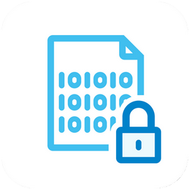

***

    <b><em>EASY-ABAC</em></b> 
    Activity Based Security Framework for Java&trade;

***

## Overview

**What is Easy-ABAC Framework?**

Usually developer teams spend much time and money creating and supporting own complex access-control 
architectures, which cannot fully match security expectations.
Fairly often REST resources remain unprotected. It's quite problematic to detect them. 
The framework will help to detect and fix that. Application will raise compilation error if any resource remains unprotected.

The aim of the **Easy-ABAC Framework** is to help you protect your REST resources from unauthorized access.
The framework provides a centralized, externalized authorization management system 
with flexible fine-grained access rights configuration in declarative manner.

**When to use?**

- Java applications
- Multi-tenant applications
- Applications with dynamic access rights
- Applications with fine-grained access rights

**Core features**

- Lightweight library and easy to learn API
- Declarative authorization
- **Compile-time** check of missing authorization of REST resources
- **Compile-time** check of proper configuration
- Built for Spring based applications

## Getting Started

Instructions you can find [here](docs/README.md).

## Contributing

Contributions are welcomed and greatly appreciated.

After creating your first contributing PR you will be requested to sign our 
Contributor License Agreement by commenting your PR with a
special message.

### Report Bugs

Report bugs [here](https://github.com/exadel-inc/activity-based-security-framework/issues).

### Latest news

* 27/12/2020: version 1.3 is out!

## Contacts
[easy-abac-support@exadel.com](mailto:easy-abac-support@exadel.com)

## License info

EASY-ABAC is Open Source software released under the [Apache 2.0 license](https://www.apache.org/licenses/LICENSE-2.0.html).